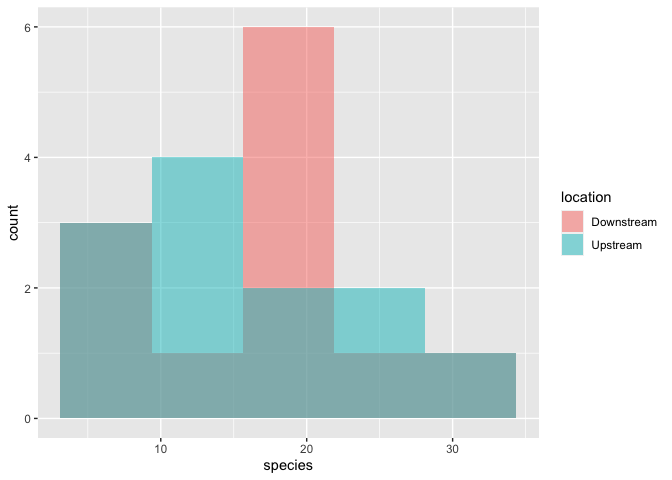
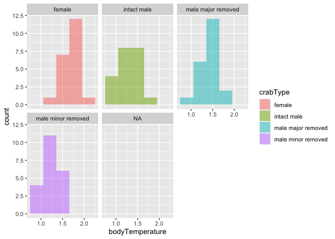

Lab 6 Comparing Two Means
================
Hiba Chaudhry

## R Markdown

Researchers studying the number of electric fish species living in
various parts of the Amazon basin were interested in whether the
presence of tributaries affected the local number of electric fish
species in the main rivers (Fernandes et al. 2004).

They counted the number of electric fish species above and below the
entrance point of a major tributary at 12 different river locations.

The data is provided in your GitHub repository.

For each question below, write a sentence answering the question and
show the code you used to come up with the answer, if applicable. like
this:

``` r
library(tidyverse)
```

    ## ── Attaching packages ─────────────────────────────────────── tidyverse 1.3.0 ──

    ## ✓ ggplot2 3.3.2     ✓ purrr   0.3.4
    ## ✓ tibble  3.0.4     ✓ dplyr   1.0.2
    ## ✓ tidyr   1.1.2     ✓ stringr 1.4.0
    ## ✓ readr   1.4.0     ✓ forcats 0.5.0

    ## ── Conflicts ────────────────────────────────────────── tidyverse_conflicts() ──
    ## x dplyr::filter() masks stats::filter()
    ## x dplyr::lag()    masks stats::lag()

``` r
fish <- read_csv("chap12q19ElectricFish.csv")
```

    ## 
    ## ── Column specification ────────────────────────────────────────────────────────
    ## cols(
    ##   tributary = col_character(),
    ##   speciesUpstream = col_double(),
    ##   speciesDownstream = col_double()
    ## )

``` r
# put data in tidy format ------------------------------------------------

fish_long <- 
  pivot_longer(fish, speciesUpstream:speciesDownstream,
               names_to = "location",
               values_to = "species") %>% 
  mutate(location = str_remove(location, c("species"))) %>% 
  print()
```

    ## # A tibble: 24 x 3
    ##    tributary location   species
    ##    <chr>     <chr>        <dbl>
    ##  1 Içá       Upstream        14
    ##  2 Içá       Downstream      19
    ##  3 Jutaí     Upstream        11
    ##  4 Jutaí     Downstream      18
    ##  5 Japurá    Upstream         8
    ##  6 Japurá    Downstream       8
    ##  7 Coari     Upstream         5
    ##  8 Coari     Downstream       7
    ##  9 Purus     Upstream        10
    ## 10 Purus     Downstream      16
    ## # … with 14 more rows

## Question A

> Test the hypothesis that the tributaries have no effect on the number
> of species of electric fish. Welch’s t ttest

``` r
fish_ttest <- t.test(species ~ location, data = fish_long)
fish_ttest$estimate
```

    ## mean in group Downstream   mean in group Upstream 
    ##                 16.41667                 14.58333

ANSWER

## Question B

> What is the difference in the mean numbers of species between areas
> upstream and downstream of a tributary? What is the 95% confidence
> interval of this difference in means?

ANSWER

``` r
fish_mean_diff <-
  fish_long %>% 
  group_by(location) %>% 
  summarize(
    n = n(),
    mean = mean(species),
    sd = sd(species),
    sem = sd/sqrt(n),
    upper = mean + 1.96 * sem,
    lower = mean - 1.96 * sem
  ) %>% 
  print()
```

    ## `summarise()` ungrouping output (override with `.groups` argument)

    ## # A tibble: 2 x 7
    ##   location       n  mean    sd   sem upper lower
    ##   <chr>      <int> <dbl> <dbl> <dbl> <dbl> <dbl>
    ## 1 Downstream    12  16.4  7.22  2.08  20.5  12.3
    ## 2 Upstream      12  14.6  7.93  2.29  19.1  10.1

## Question C

> State the assumptions that you had to make to complete parts (A) and
> (B). Create a graph to assess whether one of those assumptions was
> met.

ANSWER

``` r
fish_long %>%
    ggplot(aes(x = species)) +
    geom_histogram(
    aes(fill = location), 
    bins = 5, 
    alpha = 0.5, 
    position = "identity"
    ) 
```

<!-- -->

## Question D

> Graph the distribution of body temperatures for each crab type:

ANSWER

``` r
crabs <- read_csv("chap15q27FiddlerCrabFans.txt")
```

    ## 
    ## ── Column specification ────────────────────────────────────────────────────────
    ## cols(
    ##   crabType = col_character(),
    ##   bodyTemperature = col_double()
    ## )

``` r
crabs
```

    ## # A tibble: 85 x 2
    ##    crabType bodyTemperature
    ##    <chr>              <dbl>
    ##  1 female               1.9
    ##  2 female               1.6
    ##  3 female               1.4
    ##  4 female               1.1
    ##  5 female               1.6
    ##  6 female               1.8
    ##  7 female               1.9
    ##  8 female               1.7
    ##  9 female               1.5
    ## 10 female               1.8
    ## # … with 75 more rows

``` r
# D) 
crabs %>%
  ggplot(aes(x = bodyTemperature)) +
  geom_histogram(
    aes(fill = crabType ), 
    bins = 5, 
    alpha = 0.5, 
    position = "identity"
  ) +
  facet_wrap(~ crabType)
```

    ## Warning: Removed 1 rows containing non-finite values (stat_bin).

<!-- -->

## Question E

> Does body temperature varies among crab types? State the null and
> alternative hypothesis, conduct and ANOVA, and interpret the results.

ANSWER

``` r
aov_crabs <- 
  aov(bodyTemperature ~ crabType, data = crabs)
aov_crabs
```

    ## Call:
    ##    aov(formula = bodyTemperature ~ crabType, data = crabs)
    ## 
    ## Terms:
    ##                 crabType Residuals
    ## Sum of Squares  2.641310  3.467619
    ## Deg. of Freedom        3        80
    ## 
    ## Residual standard error: 0.2081952
    ## Estimated effects may be unbalanced
    ## 1 observation deleted due to missingness

``` r
summary(aov_crabs)
```

    ##             Df Sum Sq Mean Sq F value Pr(>F)    
    ## crabType     3  2.641  0.8804   20.31  7e-10 ***
    ## Residuals   80  3.468  0.0433                   
    ## ---
    ## Signif. codes:  0 '***' 0.001 '**' 0.01 '*' 0.05 '.' 0.1 ' ' 1
    ## 1 observation deleted due to missingness

# H0: Body temperature is equal among all crab types

# HA: At least one crab type will be different from the others

\#Interpreting the ANOVA \# Mean of crabType: .8804 \# Mean of
Residuals: .0433
